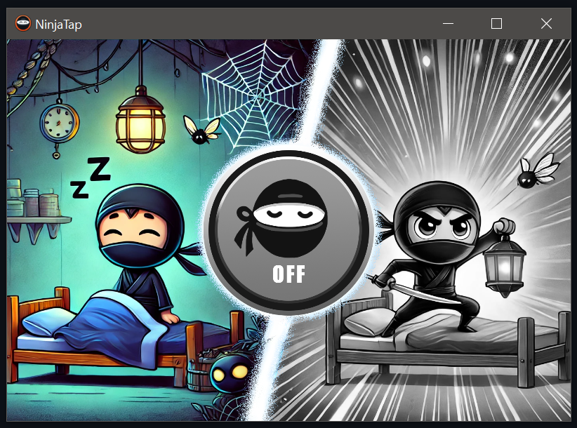

# NinjaTap
GUI app that enables null movement (Rappy Snappy/Snap Tap) for all Windows machines.
> [!Caution]
> Some games can ban you for using null movement scripts.
> If you are unsure whether a game bans the use of input scripts, please read their terms of service.

# Installation
Download the right executable file for your system from [releases](https://github.com/nexuma/NinjaTap/releases/) or compile the app manually.
> [!NOTE]  
> Only Windows 10 is supported for now, there is a bug on Windows 11.

# Null Movement
Null movement scripts allow players to move in the direction they intend without interruption or stopping when pressing opposing movement keys (e.g., left and right at the same time). These scripts cancel the stopping effect caused by simultaneous key presses, allowing faster strafing and more precise movement.
# Usage and Features
- Just click on the big button to activate fast strafing
- Supports strafing with "right and left" or "forward and backwards" movements
## Planned
- Minimizing the window to the tray
# Motivation
The primary motivation was to have a single-file executable, basically the most seamless way to start a null movement script. I also wanted to learn a bit of C#.
# Credits
- autohotkey.Interop.dll (A wrapper for autohotkey.dll written in C#) from [amazing-andrew/AutoHotkey.Interop](https://github.com/amazing-andrew/AutoHotkey.Interop)
- Null movement script from [Qiasfah/Null-Movement-Script](https://github.com/Qiasfah/Null-Movement-Script)
# Compiling
To compile the project, clone the repository and launch the project with Visual Studio 2022.
